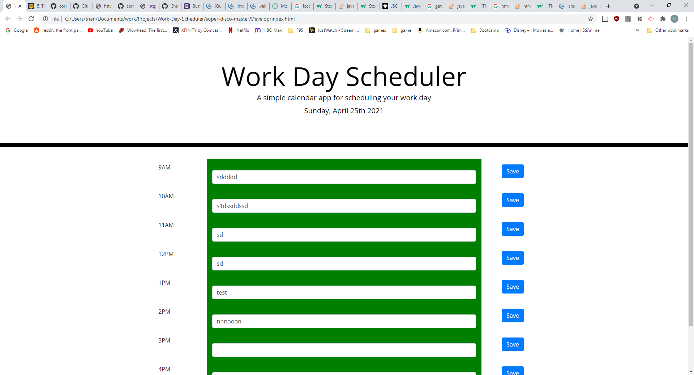

# Work Day Scheduler Challenge

This application displays a work schedule. There are text fields that can be edited at the various time intervals. If you click their adjacent "save" button, the text is saved locally. This text is loaded into these text fields on page reload. This application keeps track of time in order to both display time and give the correct background color to the text elements.

## Application

* Open [index.html](Develop/index.html) in your browser to see the deployed application.

* Use the link [https://cortelas.github.io/Work-Day-Scheduler/](https://cortelas.github.io/Work-Day-Scheduler/) to see the GitHub pages.

* Screenshot of the functioning application 